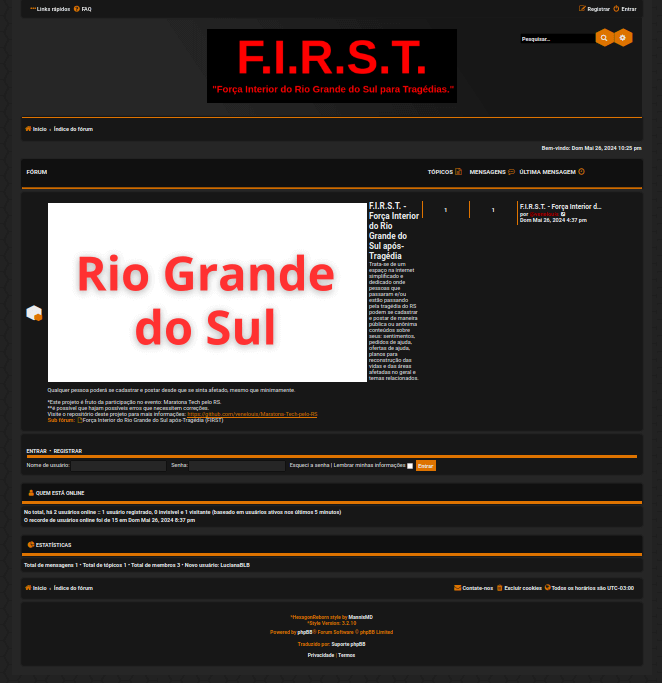

# Maratona-Tech-pelo-RS
Meu repositório do meu projeto para a: <strong>Maratona Tech pelo Rio Grande do Sul.</strong> 
*Em nome das boas práticas da internet, eu apaguei este fórum que praticamente não estava sendo utilizado,
e para não consumir recursos sem necessidade, mas vou  deixar o registro aqui neste repositório, que de fato este projeto foi realizado.
<ul>
  <li><b><ins>Nome</ins></b>: F.I.R.S.T.</li>
  <ul><li><h5>Acesse o projeto através deste link: https://maratonatechpelors.venelouis.de </h5></ul></li>
  <li><a href="./descrit">Descrição e funcionalidades (clique aqui).</a></li>
  

  <li><a href="./detalhes"> + Detalhes deste projeto (clique aqui).</a></li>
</ul>

</a> 
*Link do repositório do oficial do evento: https://github.com/TechPeloRS/maratona-pelo-rs  
*Link do site de inscrição do evento: https://www.sympla.com.br/evento-online/maratona-tech-pelo-rs/2470722

