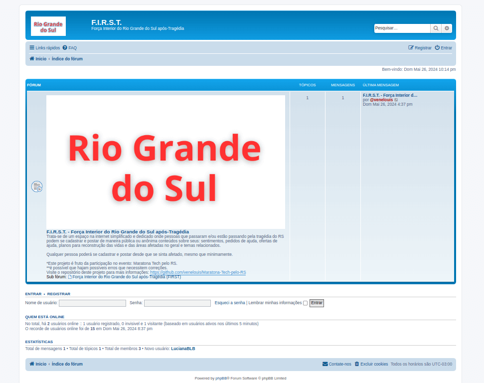
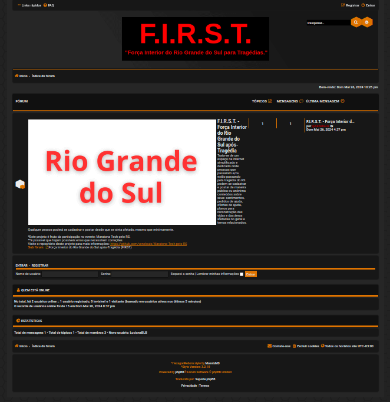

<h3>F.I.R.S.T.</h3>

<ins><b>Descrição e conceito</ins>: </b><i>"Força Interior do Rio Grande do Sul após-Tragédia"</i> (não é uma nomeclatura de significado muito preciso).

Imagem da versão inicial: 

Trata-se de um espaço na internet simplificado e dedicado (sendo um website/app) onde pessoas que passaram e/ou estão passando pela tragédia do RS podem se cadastrar e postar de maneira pública ou anônima conteúdos sobre seus: sentimentos, pedidos de ajuda, ofertas de ajuda, planos para reconstrução das vidas e das áreas afetadas no geral e temas relacionados.

Qualquer pessoa poderá se cadastrar e postar desde que se sinta afetado, mesmo que minimamente.

Este projeto será mantido através de doações e voluntários (eu mesmo) que irão atuar na moderação e manuteção da plataforma até onde conseguirem.

Funcionalidades da plaforma:
<ul>
<li>Todas as funcionalidades básicas de um fórum phpBB: https://www.phpbb.com/ (não conheço todas, mas tentei limitar algumas por motivos de "espaço", performance e segurança). </li>
<li>A logo do fórum phpBB foi substituida nas pastas raizes pela imagem: "Rio Grande do Sul" com letras vermelhas em fundo branco.</li>
</ul>

Versão final: 

<!--

- Funcionalidades básicas que esta plaforma deve possuir:
<ol>
<li>Cadastro: apenas com nome (ou apelido, não precisa ser o nome verdadeiro) do usuário e email + senha e etc.</li>
<li>Postagem: cada usário poderá realizar apenas a publicação de um tópico por dia, mas cada publicação poderá ter diversas respostas. </li>
</ol>
